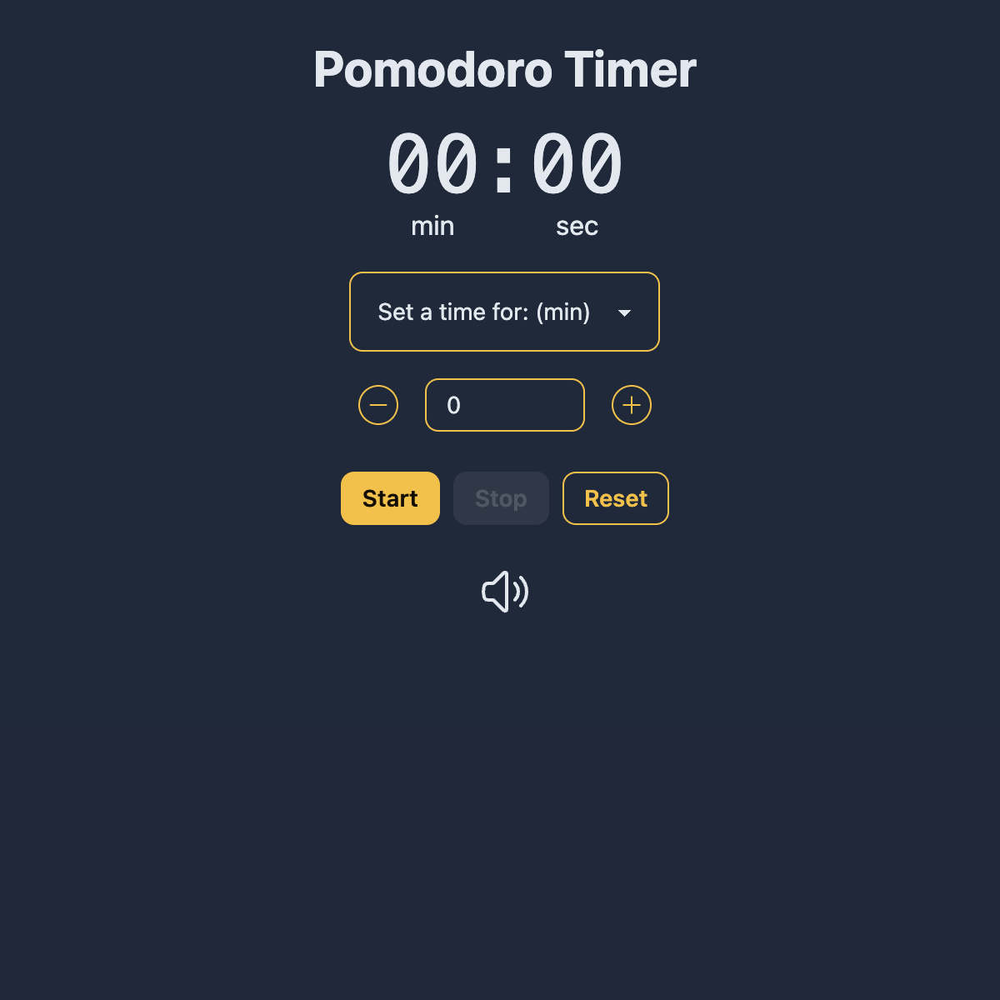
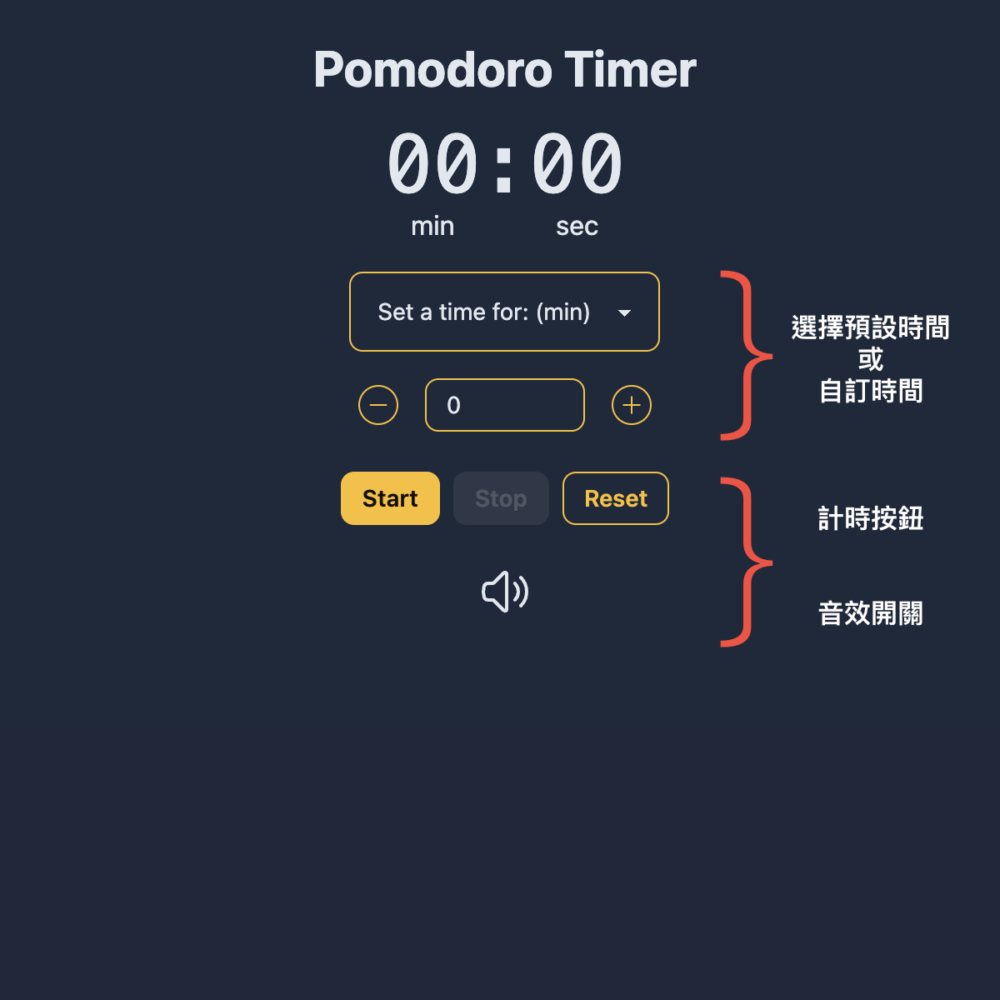
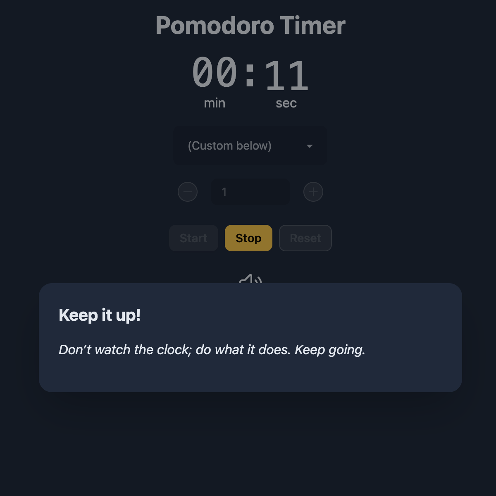
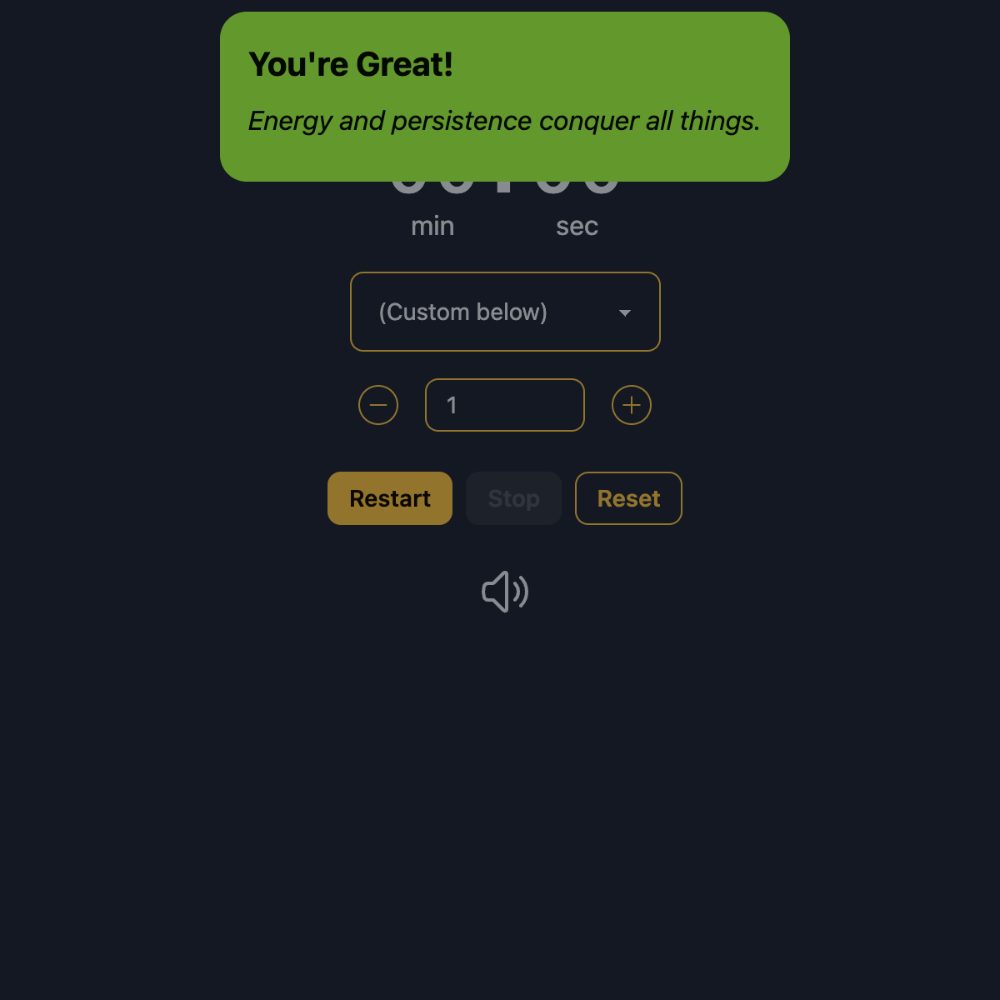
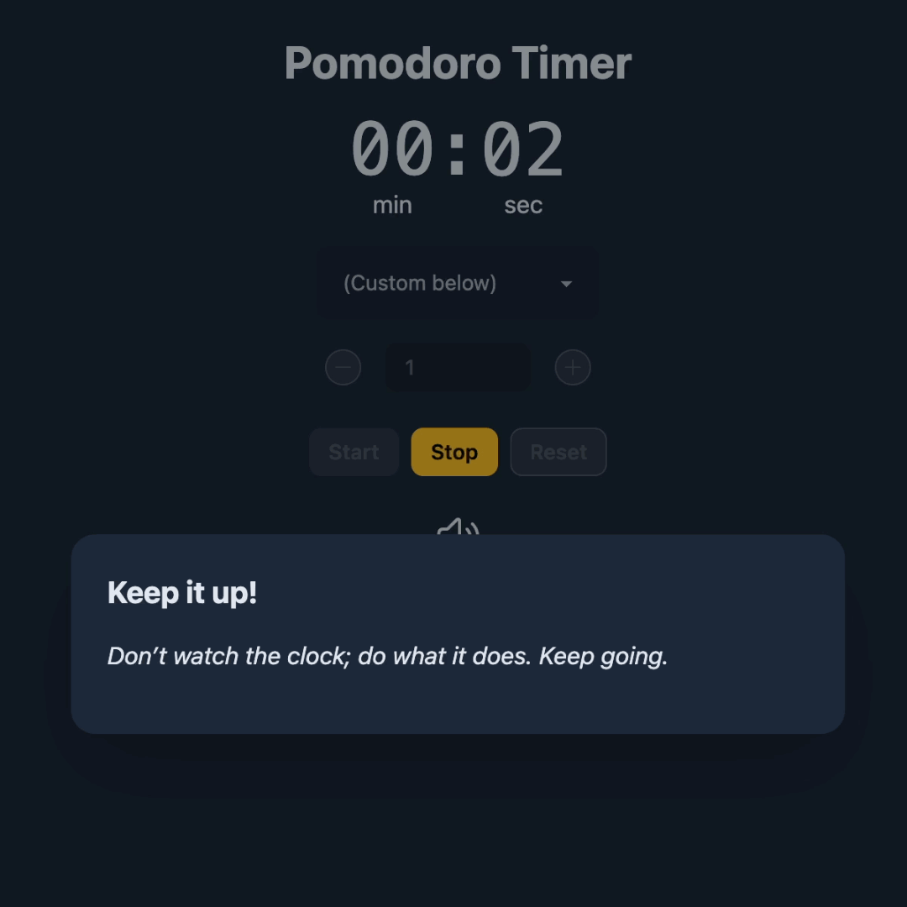

# Pomodoro timer 專注進行鐘
### 專案連結：[pomodoro-clock-rtk.vercel.app](https://pomodoro-clock-rtk.vercel.app/)

### _“Don’t watch the clock; do what it does. Keep going."_

# 專案介紹
本專案為 **專注進行鐘** ，一款具有提示音的倒數計時器供專注時使用。 
提供預設時間組合，也可自行設定時間。在按下開始的那刻，會一聲悠長迴盪的碰鈴聲，引導使用者進入專注。時間結束時，會有會有提示音響起，提醒使用者適時休息。

整體由 Vite 建構，使用 React 搭配 Tailwind CSS 與 daisy UI 打造畫面，使用 use-sound 處理音效，時間及音效的狀態管理使用 Redux Toolkit (RTK) 。

### 功能 
- 常見倒數計時組合。
- 自訂倒數計時時間。
- 開始 / 結束 提示音。
- 一鍵全靜音。

### 網站使用簡介

1. 下拉式選單可選擇預設時間(5, 10, 25, 30, 45, 60分鐘)。
2. 亦可透過加減按鈕或欄位輸入來自訂時間。
3. 按鈕列可開始倒數、停止倒數、歸零時間。
4. 音效開關一鍵靜音。

倒數開始時播放提示音及畫面。

倒數結束時，播放提示音與畫面。

## Demo

## 開發工具
- React v18.2.0
- Vite v5.0.8
- Tailwind CSS v3.4.1
- daisyUI v4.6.0
- redux v5.0.1
- reduxjs/toolkit v2.1.0
- use-sound v4.0.1
